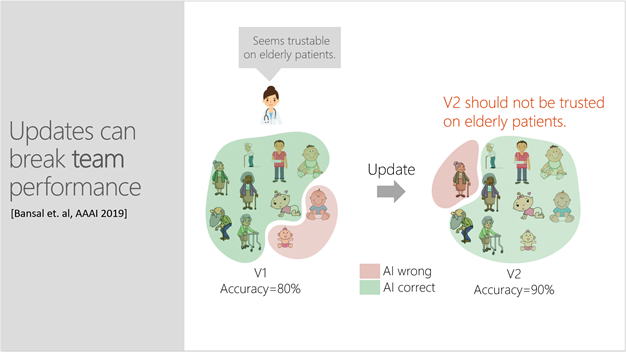
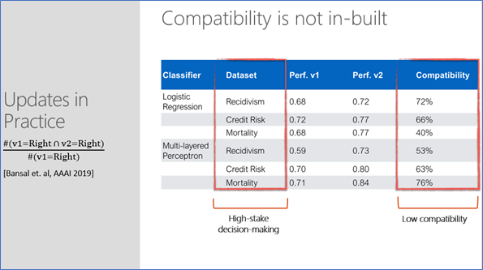
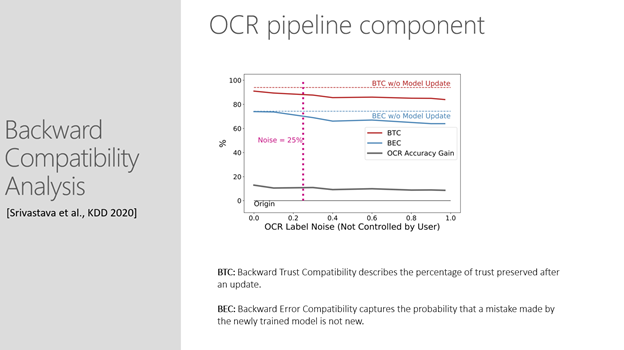
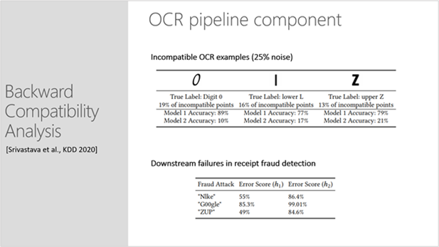

.. _overview:

Project Overview
================

Updates that may improve an AI system’s accuracy can also introduce new
and unanticipated errors that damage user trust. Updates that introduce
new errors can also break trust between software components and machine
learning models, as these errors are propagated and compounded
throughout larger integrated AI systems. The Backward Compatibility ML
library is an open-source project for evaluating AI system updates in a
new way for increasing system reliability and human trust in AI
predictions for actions.

In this project, we define an update to an AI component to be compatible
when it does not disrupt an experienced user’s insights and
expectations—or mental model—of how the classifier works. An update is
considered compatible *only if* the updated model recommends the same
correct action as recommended by the previous version, which received
the same input. A compatible update supports the user’s mental model and
maintains trust.

Compatibility is both a usability and engineering concern. This
project’s series of loss functions provides important metrics that
extend beyond the single score of accuracy. These support ML
practitioners in navigating performance and tradeoffs in system updates.
The functions integrate easily into existing AI model-training
workflows. Simple visualizations, such as Venn diagrams, further help
practitioners compare models and explore performance and compatibility
tradeoffs for informed choices.

Building trust in human-AI teams
--------------------------------

After repeated experience with an AI system, users develop insights and
expectations, a mental model, of the system’s competence. The success of
human-AI partnerships is dependent on people knowing whether to trust
the AI or override it. This is critically important as AI systems are
used to augment human decision making in high-stakes domains such as,
for example, healthcare, criminal justice, or transportation.

A problem arises when developers regularly update AI systems with
improved training data or algorithms: Updates that may improve an AI’s
predictive performance can also introduce new and unexpected errors that
breach the end-users’ trust in the AI.

For example, a doctor uses a classifier to predict whether an elderly
patient will be readmitted to the hospital shortly after being
discharged. Based on the AI’s prediction and her own experience, she
must decide if the patient should be placed in an outpatient program to
avoid readmission. The doctor has interacted with the model quite a few
times and knows that it is 80% accurate. Having learned the error
boundary, she has concluded that the model is trustworthy for elderly
patients. However, she is unaware that an update, which has made the
model 90% accurate, now introduces errors for elderly patients and
should not be trusted for this population. This puts the doctor—who is
relying on an outdated mental model—at risk of making a wrong decision
for her patient and will undermine her trust in the AI’s future
recommendations.

|image1|

Updates that may improve an AI system’s predictive performance can also
introduce new and unexpected errors that breach end-users’ trust and
damage the effectiveness of human-AI teams. Here, a doctor is not yet
aware that an update, which increased a model’s accuracy, now introduces
errors for elderly patients and should not be trusted when making
decisions for this population.

Identifying unreliability problems in an update
-----------------------------------------------

It is helpful to understand that compatibility is not inbuilt, and that
measuring backward compatibility can identify unreliability issues
during an update. As shown in the table below, experimenting with three
different datasets in high-stakes decision making (predicting
recidivism, credit risk, and mortality) by *updating with a larger
training set only,* there are cases where compatibility is as low as
40%. This means the model is now making a mistake in 60% of the cases it
was getting right before the update.

|image2|

Maintaining component-to-component trust
----------------------------------------

An incompatible update can also break trust with other software
components and machine learning models that are not able to handle new
errors. They instead propagate and compound these new errors throughout
complex systems. Measuring backward compatibility can identify
unreliability issues during an update and help ML practitioners control
for backward compatibility to avoid downstream degradation.

For example, a financial services team uses an off-the-shelf OCR model
to detect receipt fraud in expense reports. They have developed a
heuristic blacklist component of spoofed company names (e.g., “Nlke” vs.
“Nike” or “G00gle” vs. “Google”), which works well with the OCR model.
Developers, with the aim of improving model performance for a wider
variety of fonts, update the model with a noisy dataset of character
images scraped from the internet, which people have labelled through
CAPTCHA tasks. Common human annotation mistakes of confusing “l” for “i”
or “0” for “o” now unexpectedly reduce the classifier’s ability to
discriminate between spoofed and legitimate business names, which can
lead to costly system failures.

As shown in the image below, developers can use two separate measures of
backward compatibility for evaluating and avoiding downstream failures:
Backward Trust Compatibility (BTC), which describes the percentage of
trust preserved after an update, and Backward Error Compatibility (BEC),
which captures the probability that a mistake made by the newly trained
model is not new. The 89% BTC and 71% BEC scores show a decrease in
backward compatibility compared with the baseline.

|image3|

In this example, above, while the overall accuracy of word recognition might
improve after the model update, the performance of the system on
specific words in the blacklist heuristics may degrade significantly.
Additionally, with backward compatibility analysis, seeing the
distribution of incompatibility can be a useful guide for pinpointing
where there are problems with the data.

Below illustrates how a holistic view of decreases in performance enable 
users to monitor incompatibility beyond examples that are explicitly 
impacted by noise. Here, the uppercase “Z” is often among incompatible 
points, even though it is not directly influenced by noise.

|image4|

Components
----------

The Backward Compatibility ML library has two components:

-  **A series of loss functions** in which users can vary the weight
   assigned to the dissonance factor and explore performance/capability
   tradeoffs during machine learning optimization.

-  **Visualization widgets** that help users examine metrics and error
   data in detail. They provide a view of error intersections between
   models and incompatibility distribution across classes.

References
----------

*Updates in Human-AI Teams: Understanding and Addressing the
Performance/Compatibility Tradeoff.* Gagan Bansal, Besmira Nushi, Ece
Kamar, Daniel S Weld, Walter S Lasecki, Eric Horvitz; AAAI 2019. `pdf <https://www.microsoft.com/en-us/research/uploads/prod/2019/01/Backward_Compatibility_in_AI.pdf>`__ 

*An Empirical Analysis of Backward Compatibility in Machine Learning
Systems.* Megha Srivastava, Besmira Nushi, Ece Kamar, Shital Shah, Eric
Horvitz; KDD
2020. `pdf <https://www.microsoft.com/en-us/research/uploads/prod/2020/06/Backward_Compatibility_ML_KDD.pdf>`__ 

*Towards Accountable AI: Hybrid Human-Machine Analyses for
Characterizing System Failure.* Besmira Nushi, Ece Kamar, Eric Horvitz;
HCOMP 2018. `pdf <https://www.microsoft.com/en-us/research/uploads/prod/2018/07/accountable_AI_hcomp_2018.pdf>`__  

