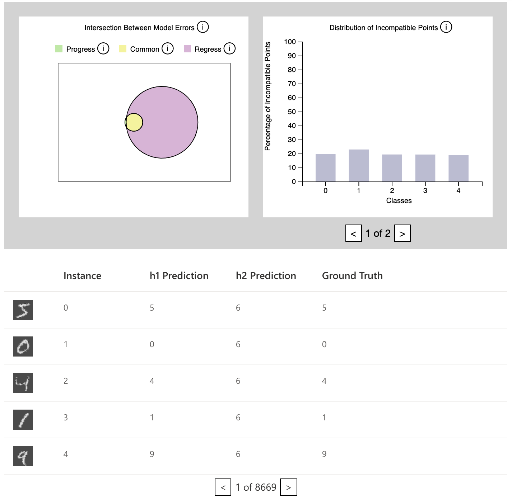

.. _using_and_integrating_the_model_comparison_widget:

Using the Model Comparison Widget
=================================================================

The model comparison widget uses the notion of compatibility to compare two
models ``h1`` and ``h2``. The widget itself uses two graphs to display this
comparison:

1. A Venn diagram that displays the overlaps between the set of misclassified
instances produced by ``h1`` and the set of misclassified instances produced
by model ``h2``.

2. A histogram that shows the number of incompatible instances, i.e. instances
which have been misclassified by ``h2`` but not by ``h1``, on a per-class
basis.

A tabular view is also provided, that allows the user to explore the instances
which have been misclassified. This tabular view is connected to both the
Venn diagram and the histogram, and gets filtered based on how the user
interacts with both those graphs.

The following is an image of the model comparison widget.

How to Use the ModelComparison API
----------------------------------------

The model comparison widget accepts two models which are classifiers, ``h1`` and ``h2``.
It also accepts a batched dataset consisting of a list of triples of the form:

``[batch_of_instance_ids, batch_of_instance_data, batch_of_ground_truth_labels]``

An optional parameter is a function passed in as a keyword parameter called
``get_instance_image_by_id`` which is a function that returns a PNG image
for a given instance id. This is what allows the error instances table to
display an image representation of each instance. If this parameter is not
specified, then the image representation of the instance defaults to a blank
PNG image.

An additional optional parameter is ``device``, which tells it whether it needs to run
the comparison on the GPU. This depends on whether your models are on the GPU or not.

With all the parameters as specified above, the widget may be invoked::

    model_comparison = ModelComparison(h1, h2, train_loader,
                                       get_instance_image_by_id=get_instance_image,
                                       device="cuda")

Within a Jupyter Notebook the above will render the component.

An example notebook which walks you through a working example may be found at
``./examples/model-comparison-MNIST`` from the BackwardCompatibilityML project root.

Integrating the Model Comparison Widget
---------------------------------------

The data used to summarize the comparison of the models ``h1`` and ``h2``
and display the results int he widget, are all pre-computed at the time of
instantiation of the widget. This data is then passed directly to the
widget UI at the time of rendering. And as such, any interactions tht the
user performs with the widget, simply re-render the widget using this
pre-computed data.

Integration should just involve pre-computing the comparison data and making
sure that it is passed to the javascript component at render time.

The relevant places to see where this happens are within the following files.

- ``backwardcompatibilityml/widgets/model_comparison/resources/widget.html``
- ``backwardcompatibilityml/widgets/model_comparison/model_comparison.py``

The Flask service is only used to field the requests from the widget UI that
are needed to render the image representation of the widgets. This is currently
done within the file ``backwardcompatibilityml/comparison_management.py``.

It should be possible to do away with the Flask service in theory, if we simply
pre-render each image as a base64 encoded data URL and include that in the UI.
However this risks making the UI a bit slow to load.
