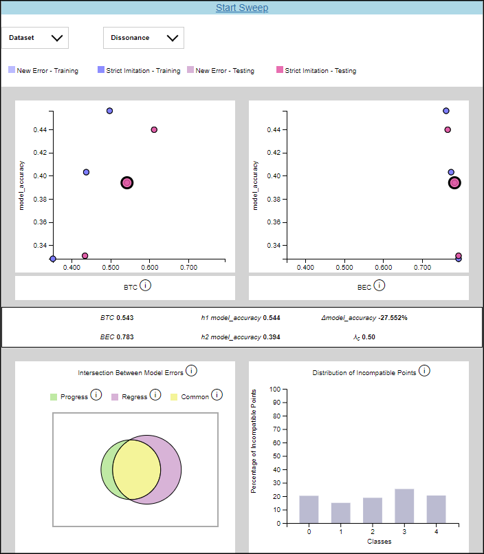
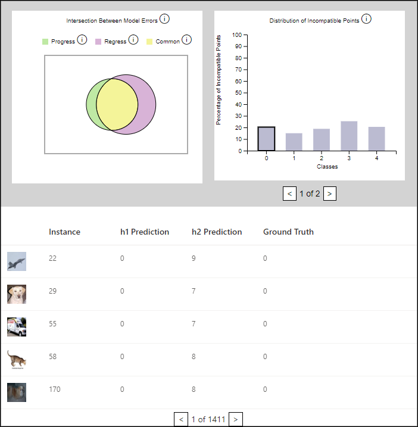

.. _using_the_compatibility_analysis_widget:

Using the Backward Compatibility ML Compatibility Analysis Widget
=================================================================

The compatibility analysis widget can be used to quickly determine which loss
function and value of |lambda|:sub:`c` performs best for your models. The widget will
make a sweep of the possible values for |lambda|:sub:`c` and show a visualization of the
results. We will discuss how to use the CompatibilityAnalysis API and how to interpret
the resulting visualizations.

How to Use the CompatibilityAnalysis API
----------------------------------------

The CompatibilityAnalysis API has a large number of parameters. To view the Python documentation
for the API, execute ``?CompatibilityAnalysis`` within a Jupyter notebook. The documentation  for all of the parameters will be displayed at the bottom of the window.

In this article, we will reference the ``compatibility-analysis-cifar10-resnet18`` example notebook.
You can find this notebook at ``./examples/compatibility-analysis-cifar10-resnet18`` from the
BackwardCompatibilityML project root. This notebook uses the widget to compare the performance of 
resnet18 with the following 6 layer network using the cifar10 dataset::

    class Net(nn.Module):
        
        def __init__(self):
            super().__init__()
            self.conv1 = nn.Conv2d(3, 18, kernel_size=3, stride=1, padding=1)
            self.fc2 = nn.Linear(18*32*32, 192)
            self.fc3 = nn.Linear(192, 192)
            self.fc4 = nn.Linear(192, 192)
            self.fc5 = nn.Linear(192, 192)
            self.fc6 = nn.Linear(192, 10)
        
        def forward(self, x):
            x = F.relu(self.conv1(x))
            x = x.view(-1, 18*32*32)
            x = F.relu(self.fc2(x))
            x = F.relu(self.fc3(x))
            x = F.relu(self.fc4(x))
            x = F.relu(self.fc5(x))
            x = self.fc6(x)
            
            return x, F.softmax(x, dim=1), F.log_softmax(x, dim=1)

The last cell in the notebook instantiates the widget::

    analysis = CompatibilityAnalysis("sweeps-cifar10", 5, h1, h2, train_loader, test_loader,
        batch_size_train, batch_size_test,
        OptimizerClass=optim.SGD,
        optimizer_kwargs={"lr": learning_rate, "momentum": momentum},
        NewErrorLossClass=bcloss.BCCrossEntropyLoss,
        StrictImitationLossClass=bcloss.StrictImitationCrossEntropyLoss,
        lambda_c_stepsize=0.50,
        get_instance_image_by_id=get_instance_image,
        device="cuda")

Here, ``h1`` refers to the resnet18 model, and ``h2`` refers to the simple Net model.
``train_loader`` and ``test_loader`` are the train and test datasets. The ``BCCrossEntropyLoss``
and ``StrictImitationCrossEntropyLoss`` loss functions will be used to train ``h2``.
``lambda_c_stepsize`` has been set to a relatively large value of 0.50 to reduce runtime.
The number of samples of |lambda|:sub:`c` in the sweep is inversely proportional to ``lambda_c_stepsize``.
In other words, if ``lambda_c_stepsize`` is small, then the sweep will compute many samples,
many points will be shown in the scatter plot, and the sweep will take longer to finish.

Interpreting the Visualizations
-------------------------------

The first time the CompatibilityAnalysis widget is run, only a Start Sweep button will be shown.
Click on it to start the sweep. The sweep will likely take several minutes to run.
When it is complete, the widget will plot the results. The following screenshot shows
the results from the compatibility-analysis-cifar10-resnet18 example notebook.

The drop-down menus contain options to filter the data shown in the scatter plots. The Dataset
drop-down has options for selecting the training or testing set data. The Dissonance drop-down
has options for selecting the New Error or Strict Imitation loss functions.

The two scatter plots graph the backward compatibility of the model against the model accuracy for a particular
value of |lambda|:sub:`c`. Hovering over a point shows the value of |lambda|:sub:`c` for that point. Clicking on a point
loads detailed results and error analysis for that particular value of |lambda|:sub:`c`.

The numeric values for BTC, BEC, model accuracy, and |lambda|:sub:`c` are shown in a table in the middle of the widget.
Below that table, there is a Venn diagram and a histogram that plot the errors made by each model.
The Venn diagram shows the intersection of errors made by the previous model with errors made by the new model.
The red region represents errors made only by the new model, the yellow region represents errors made by both models,
and the green region represents errors made only by the old model. The histogram breaks down incompatible data points by class.
A point is considered incompatible if it was classified correctly by the old model but incorrectly by the new model. 
Note that the histogram is paginated with five classes shown per page.

The bars on the histogram and regions of the Venn diagram are clickable. When clicked,
the data instances that have been misclassified will be displayed in a table at the bottom of the widget.
This table is useful for exploring the dataset to determine why the models are misclassifying the data.

In the example below, class 0 has been selected in the histogram. The mislabeled pictures are shown in the
table underneath. Notice that h1's predictions match the ground truth for each data point while h2's predictions
do not. This is what we would expect to see based on our definition of incompatible points.

The CompatibilityAnalysis API contains two optional parameters, ``get_instance_metadata`` 
and ``get_instance_image_by_id``, that make the data shown in the table more descriptive. 
Pictures will be shown in the table if ``get_instance_image_by_id`` is provided, and a
descriptive label will be shown if ``get_instance_metadata`` is provided. 
Both of these parameters are functions.

Here is an example implementation of ``get_instance_image_by_id``. It returns an image in PNG format
for the data instance specified by instance_id.

.. code-block:: python

    def get_instance_image(instance_id):
        img_bytes = io.BytesIO()
        data = np.uint8(np.transpose((unnormalize(dataset[instance_id][1])), (1, 2, 0)).numpy() * 255)
        img = Image.fromarray(data, 'RGB')
        img.save(img_bytes, format="PNG")
        img_bytes.seek(0)
        return send_file(img_bytes, mimetype='image/png')

Here is an example implementation of ``get_instance_metadata``. It returns a string for the data instance
specified by instance_id.

.. code-block:: python

    def get_instance_metadata(instance_id):
        label = data_loader[instance_id][2].item()
        return str(label)

.. |lambda| unicode:: U+003BB
